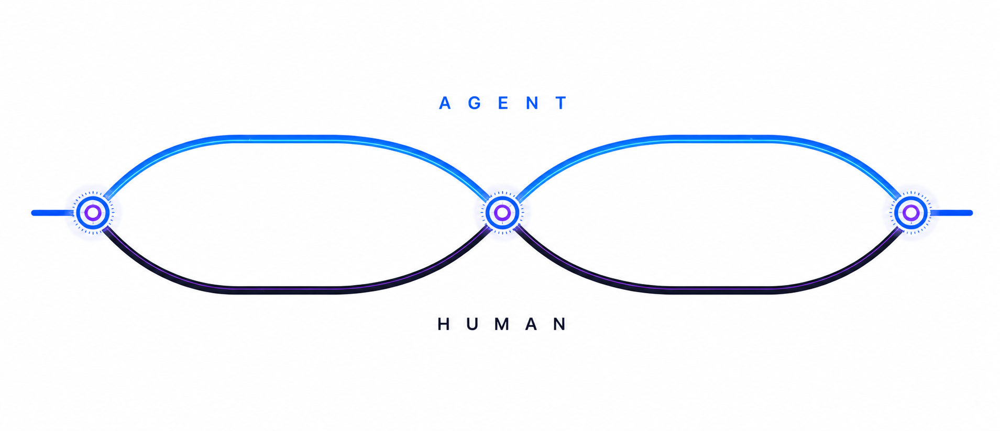
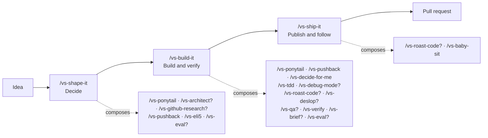
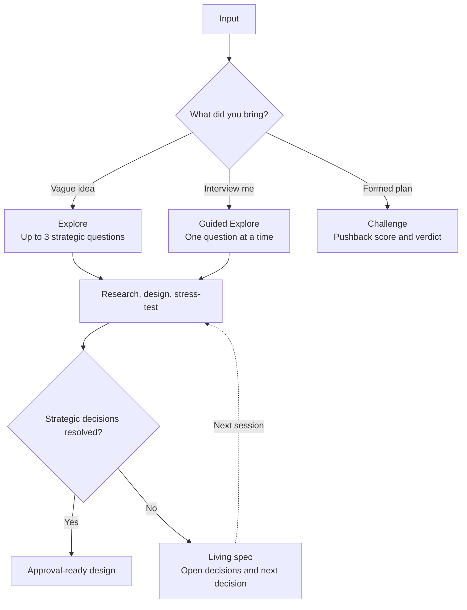
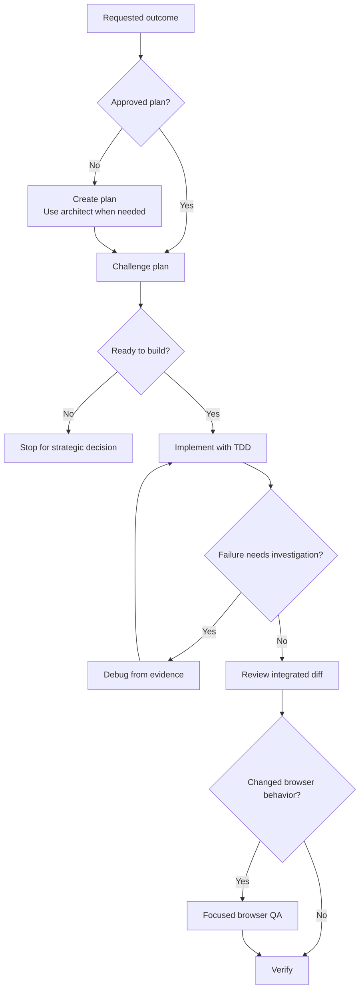
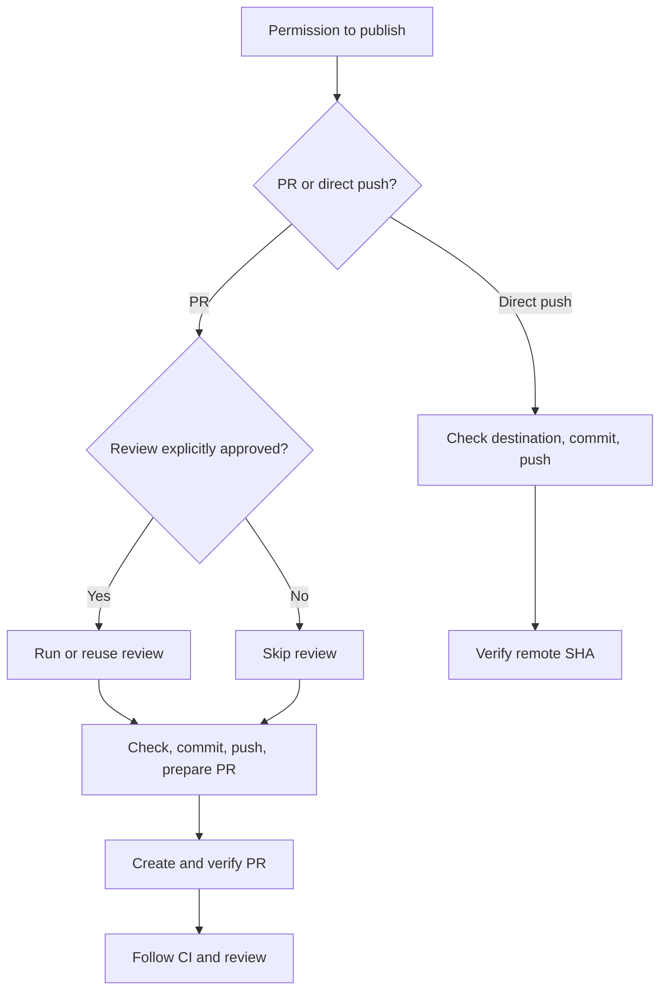

# vs

vs is built for the handshake between humans and coding agents. It gives agents
the context and methods to run longer without getting stuck, then helps them
explain the result and ask for human input in a form people can quickly
understand.

The result is longer autonomous agent runs with clear points for humans to
review, align, and redirect the work.



## Work in different rhythms

Agents and humans work on different timescales. An agent can stay inside a task
long enough to plan, implement, test, debug, and verify. Human attention moves
between projects, so context fades. When the agent needs direction, raw logs
and long explanations force the human to reconstruct the task.

vs improves both sides of that handshake. Between handshakes, it gives the
agent shared context and methods such as planning, TDD, debugging, review, QA,
and verification to keep moving for longer. At each handshake, the agent turns
its work into a short explanation and evidence the human can inspect, including
test results, diffs, screenshots, and video. It asks only the questions or
decisions needed for the next run.

The human brings wider context, priorities, judgment, and taste. They review
the evidence, align the direction, and focus the next stretch of work. The
result is longer autonomous agent runs and clearer, lower-effort human
involvement.

## How vs works



`?` means conditional. `/vs-ponytail` is both a public building block and an
always-on solution-size rule delivered to Claude and Codex sessions by hooks.
Shape-it uses it to cut scope, build-it uses it while planning and implementing,
and roast-code uses it to identify removable machinery during review.

## Core workflows

### `/vs-shape-it`: turn intent into an approved direction

Turns an idea into an evidence-backed design for your approval.



### `/vs-build-it`: turn the direction into working code

Turns the approved direction into working, verified code.



### `/vs-ship-it`: publish and follow through

Publishes the scoped work and reports its CI and review status.



## Quick start

### Install

Codex:

```bash
codex plugin marketplace add vltansky/vs
codex plugin add vs@vs
```

Claude Code:

```text
/plugin marketplace add vltansky/vs
/plugin install vs@vs
```

### Use

```text
/vs-shape-it Add saved filters to search
/vs-build-it Implement the approved design
/vs-ship-it
```

## Other skills

Core workflows compose smaller skills automatically. Invoke another skill when
you want a different entry point or one specific phase.

| Layer | Skills | Use them for |
|---|---|---|
| Core workflows | `/vs-shape-it`, `/vs-build-it`, `/vs-ship-it` | Taking a change from idea to pull request |
| Advanced workflows | `/vs-improve`, `/vs-bugfix`, `/vs-fix-pr`, and others | Starting from a different situation or owning a specialized outcome |
| Building blocks | `/vs-tdd`, `/vs-debug-mode`, `/vs-qa`, `/vs-verify`, and others | Controlling one specific phase directly |

### Minimum solutions by default

VS chooses the smallest complete solution that meets the requirements. It does
not trade away security, accessibility, tests, or verification.
`/vs-ponytail` owns this rule: avoid new code when possible, then prefer
repository reuse, the standard library or native platform, an installed
dependency, and only then the smallest local implementation. Meaningful uses
show the chosen rung, machinery avoided, completeness proof, and deferred
scope.

Shape-it composes Ponytail into its proposed cut. Build-it applies it during
planning, implementation, and the final cleanup pass. Pushback applies it while
challenging scope, alternatives, and proposed machinery. Roast-code runs a
named Ponytail pass for both large and small reviews. Claude and Codex also
receive the canonical contract through session and subagent hooks, so it
applies outside explicit VS workflows. Set `VS_PONYTAIL=off` to troubleshoot
the hook; `VS_MINIMUM_SOLUTION=off` remains a compatibility alias.

### Advanced workflows

| Skill | Use it to |
|---|---|
| `/vs-architect` | Find and compare evidence-backed ways to deepen a codebase's modules |
| `/vs-improve` | Audit a repo and write prioritized implementation plans without editing source |
| `/vs-bugfix` | Reproduce, fix, verify, and review a bug end to end |
| `/vs-fix-pr` | Evaluate and address PR feedback with approval before replies or resolution |
| `/vs-baby-sit` | Keep a PR merge-ready as CI and review state changes |
| `/vs-orchestrate` | Coordinate a multi-milestone project via a living roadmap, one milestone at a time |

Architecture: /vs-architect -> /vs-shape-it -> /vs-build-it

### Building blocks

| Skill | Use it to |
|---|---|
| `/vs-ponytail` | Choose the smallest complete solution and expose what machinery it avoided |
| `/vs-pushback` | Stress-test an idea, spec, or plan, with risk-gated independent model challenge |
| `/vs-prototype` | Answer one UI or logic question with throwaway code |
| `/vs-github-research` | Find external GitHub examples, patterns, and prior art |
| `/vs-htmdx` | Turn source material into one portable visual HTMDX artifact |
| `/vs-rfc-research` | Turn code and research evidence into an RFC, ADR, or proposal |
| `/vs-tdd` | Run a red-green-refactor loop |
| `/vs-debug-mode` | Find a root cause before proposing a fix |
| `/vs-roast-code` | Review a diff in two passes, with a second opinion for substantial changes |
| `/vs-roast-ui` | Review a UI for hierarchy, accessibility, responsiveness, and generic design |
| `/vs-qa` | Test a web interface in a browser, fix issues, and verify again |
| `/vs-verify` | Prove a change works with concrete evidence |
| `/vs-deslop` | Simplify bloated or repetitive code without changing behavior |
| `/vs-write` | Write or reshape clear prose without losing substance |
| `/vs-brief` | Turn a git diff into a concise review brief |
| `/vs-tldr` | Compress the last explanation: shorter and simpler, same meaning |
| `/vs-eli5` | Explain from zero with big pictures and few words, via `/vs-htmdx` |
| `/vs-eval` | Write PathGrade static pins and live evals with exclusive contracts, not slogan mentions |
| `/vs-tune-skill` | Grade one named skill from local chats and propose a scratch diff |
| `/vs-explain-diff` | Explain a code change in depth, with intuition, diagrams, and reader self-check questions |
| `/vs-perf` | Optimize performance against an explicit evaluator |
| `/vs-to-issues` | Turn a plan, spec, or RFC into vertical-slice GitHub issues |
| `/vs-steal` | Find ideas worth porting from another repository |
| `/vs-setup-adr` | Add an ADR convention and scaffolding to a repository |
| `/vs-decide-for-me` | Resolve tactical uncertainty before interrupting you |
| `/vs-next` | Decide whether the current work should continue, delegate, hand off, compact, clear, or stop |
| `/vs-search-threads` | Find and diagnose Codex, Claude Code, or Cursor conversations from transcript evidence |
| `/vs-recap` | Explain the current situation or recent changes from zero prior context, with next actions |
| `/vs-retro` | Extract session learnings and route them to durable destinations |
| `/vs-try-skill` | Blind-test a skill and compare its behavior with expectations |

## Other installation options

vs ships native plugin manifests for Claude Code, Codex, and Cursor. All three
load the same `SKILL.md` files under `skills/`.

### GitHub CLI

This one-time installer uses your existing `gh` authentication and also works
for private clones:

```bash
gh api repos/vltansky/vs/contents/install.sh -H "Accept: application/vnd.github.raw" | bash
```

On Windows:

```powershell
gh api repos/vltansky/vs/contents/install.ps1 -H "Accept: application/vnd.github.raw" | iex
```

From a clone, run `./install.sh` or `npm run install-plugin` (Windows:
`./install.ps1` or `npm run install-plugin:windows`).

Re-run the installer to update every detected agent.

### Cursor

Cursor 2.5+ has no plugin-install CLI. For automatic updates, import
`vltansky/vs` through a team marketplace and turn on **Enable Auto Refresh**.
Otherwise, clone the plugin locally and reload Cursor:

```bash
git clone https://github.com/vltansky/vs ~/.cursor/plugins/local/vs
```

You can also copy any self-contained directory under `skills/` into your agent's
skills folder.

## Included tooling

vs includes [octocode MCP](https://github.com/bgauryy/octocode-mcp) for
evidence-backed code research. It supports `/vs-github-research`,
`/vs-rfc-research`, `/vs-steal`, and prior-art passes in `/vs-shape-it` and
`/vs-pushback`. If a host does not load plugin MCP config, those skills fall
back to the [octocode CLI](https://octocode.ai/)
(`npx -y octocode-cli@latest --tool <name> --queries '<json>' --json`), which
exposes the same tools.

Optional tools add capabilities without being required for the rest of vs:

- [dev-browser](https://github.com/anthropics/dev-browser) for browser QA
- [`gh`](https://cli.github.com/) for PR creation and review threads
- [Codex CLI](https://github.com/openai/codex) for cross-model review

## Developing skills

```text
skills/            skill definitions and supporting files
skills/vs-*/test/  PathGrade behavior evals and fixtures
adr/               architecture decision records
vitest.config.ts   PathGrade plugin configuration
```

Skill behavior is tested with
[`@wix/pathgrade`](https://github.com/wix-incubator/pathgrade), which runs a real
coding agent against each skill and scores the result. Evals live beside their
skills in `skills/vs-*/test/*.eval.ts`.

On macOS, PathGrade can reuse local Claude Code or Codex subscription credentials
from Keychain. Set `ANTHROPIC_API_KEY` or `OPENAI_API_KEY` only when you want to
use a key or proxy instead.

```bash
npm install
npm run typecheck
npm run eval:static
npm run eval
npm run eval -- skills/vs-shape-it/test
PATHGRADE_AGENT=codex npm run eval
npm run eval:preview
```

Use `npm run eval:static` as the default edit loop. Each behavior eval starts a
live agent, so the full `npm run eval` suite takes minutes and may require agent
credentials.

Prefer the `npm run eval*` scripts so PathGrade's Vitest timeouts and worker
caps stay consistent. On macOS, PathGrade reuses Claude Code Keychain OAuth
without copying `~/.claude.json` or enabling Claude.ai MCP connectors.

## Acknowledgements

vs builds on ideas from
[superpowers](https://github.com/obra/superpowers),
[Ponytail](https://github.com/dietrichgebert/ponytail),
[Matt Pocock's skills](https://github.com/mattpocock/skills),
[oh-my-claudecode](https://github.com/yeachan-heo/oh-my-claudecode),
[gstack](https://github.com/garrytan/gstack),
[shadcn/improve](https://github.com/shadcn/improve),
[OpenClaw's agent skills](https://github.com/openclaw/agent-skills), and
[Impeccable](https://github.com/pbakaus/impeccable).

The pipeline framing owes a lot to gstack. vs applies these ideas to repository
work with explicit skill layers, flow contracts, built-in review and testing,
and durable handoffs between humans and coding agents.

See [Third-party notices](THIRD_PARTY_NOTICES.md) for source and license details.

## License

MIT
