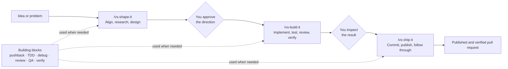
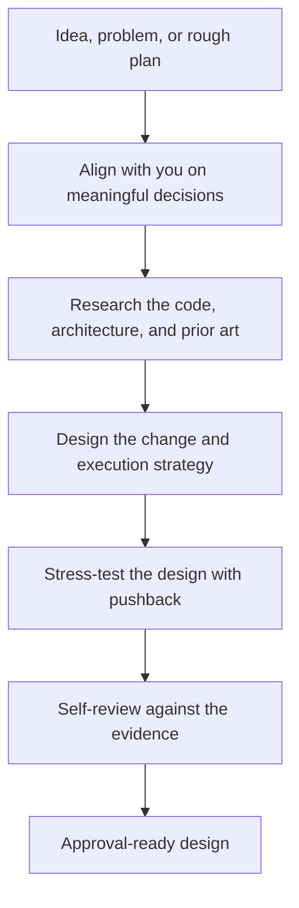
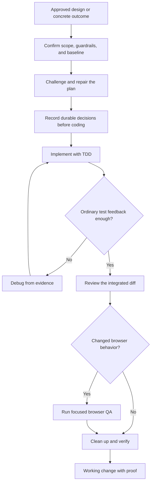
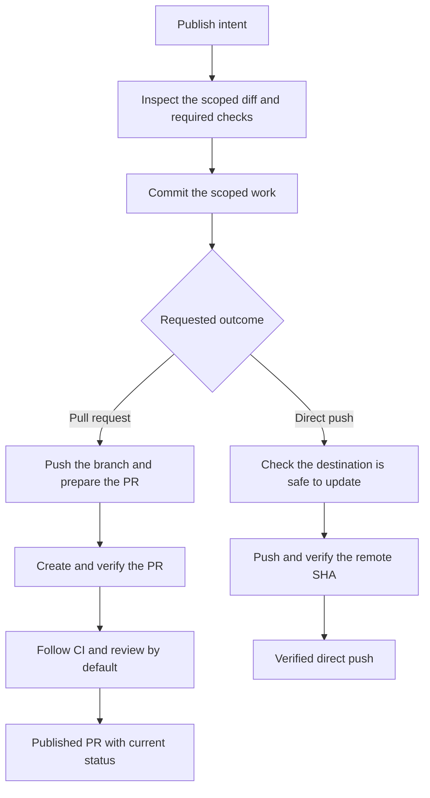

# vs

vs turns an idea into a verified pull request while keeping the important
decisions with you. It gives Claude Code, Codex, and Cursor three workflows for
shaping the direction, building autonomously, and publishing the result.

You decide product intent, scope, and whether to publish. VS handles the routine
research, implementation decisions, tests, review, QA, verification, and CI
follow-through within those boundaries.

## How vs works



These are owning workflows: each drives an outcome and composes smaller skills
when their phase is needed. You do not need to invoke TDD, debugging, review,
QA, or verification yourself. Call a building block directly only when you want
that one job rather than the complete workflow.

This structure avoids two common agent failures: guessing through decisions
that need your judgment, and stopping to ask about routine choices. VS stops at
strategic or authorization boundaries and keeps moving when the next step is
mechanical and in scope.

## What each core workflow does

### `/vs-shape-it`: turn intent into an approved direction

Give it an idea, problem, or rough plan. It returns an evidence-backed design
with the scope, decisions, risks, and execution strategy needed to build it.



### `/vs-build-it`: turn the direction into working code

Give it an approved design or a concrete outcome. It returns implemented code,
verification evidence, and a clear handoff for your inspection.



### `/vs-ship-it`: publish and follow through

Give it permission to publish. It commits only the scoped work, verifies the
remote result, and reports the current delivery status.



## Start in one minute

### 1. Install vs

Install vs through your agent's marketplace so future releases are picked up
automatically.

For Codex:

```bash
codex plugin marketplace add vltansky/vs
codex plugin add vs@vs
```

Codex refreshes Git marketplaces and installed plugins automatically at startup.

For Claude Code:

```text
/plugin marketplace add vltansky/vs
/plugin install vs@vs
```

Third-party Claude Code marketplaces do not auto-update by default. Open
`/plugin`, select **Marketplaces → vs → Enable auto-update**, then restart your
agent session. Cursor installation options are below.

### 2. Shape the direction

Open your project in the agent and describe what you want:

```text
/vs-shape-it Add saved filters to search
```

Stay for a short alignment round. VS then researches and stress-tests the
direction independently before returning with a complete design for approval.

### 3. Build it

When the design is ready, hand it to the agent:

```text
/vs-build-it Implement the approved design
```

VS executes the approved scope autonomously and returns working code with its
verification evidence.

### 4. Ship it

Review the result. When you are satisfied, publish it:

```text
/vs-ship-it
```

VS creates and verifies the pull request, then follows CI and review unless you
ask it not to.

That is the complete beginner workflow. Use these three skills for your first few
changes. The rest of vs is there when you need more control over a specific kind
of work.

## Go deeper when you need to

Start with the three core workflows. The other skills provide a different entry
point or direct control over one phase:

| Layer | Skills | Use them for |
|---|---|---|
| Core workflows | `/vs-shape-it`, `/vs-build-it`, `/vs-ship-it` | Taking a change from idea to pull request |
| Advanced workflows | `/vs-improve`, `/vs-bugfix`, `/vs-fix-pr`, and others | Starting from a different situation or owning a specialized outcome |
| Building blocks | `/vs-tdd`, `/vs-debug-mode`, `/vs-qa`, `/vs-verify`, and others | Controlling one specific phase directly |

For example, invoke `/vs-debug-mode` when you only want a root-cause
investigation, or `/vs-verify` when you only want final proof.

### Minimum solutions by default

vs looks for the smallest complete solution after it understands the affected
code and the requested outcome. It checks, in order, whether it can avoid new
code, reuse the repository, use the standard library or native platform, reuse
an installed dependency, express the change clearly in one line, or write the
smallest new implementation.

This gate reduces machinery, not quality. It does not relax requirements,
security, accessibility, error handling, tests, research, or verification.

`/vs-shape-it`, `/vs-architect`, `/vs-build-it`, and other workflows that decide
solution size apply the gate explicitly. Claude Code and Codex also load it for
sessions and subagents through plugin hooks, so it still applies when you work
outside `/vs-build-it`. Set `VS_MINIMUM_SOLUTION=off` only when you need to
disable that global hook for testing or troubleshooting; explicit workflow
guidance remains active. Cursor receives the guidance through the workflows it
loads rather than through a plugin hook.

### Advanced workflows

| Skill | Use it to |
|---|---|
| `/vs-architect` | Find and compare evidence-backed ways to deepen a codebase's modules |
| `/vs-improve` | Audit a repo and write prioritized implementation plans without editing source |
| `/vs-bugfix` | Reproduce, fix, verify, and review a bug end to end |
| `/vs-fix-pr` | Evaluate and address PR feedback with approval before replies or resolution |
| `/vs-baby-sit` | Keep a PR merge-ready as CI and review state changes |
| `/vs-orchestrate` | Coordinate a multi-milestone project via a living roadmap, one milestone at a time |

`/vs-improve` can also find or specify work before the main flow:

```text
Find direction:       /vs-improve next -> /vs-shape-it -> /vs-build-it
Specify one concern:  /vs-improve plan <thing> -> /vs-build-it
Before shipping:      /vs-improve branch -> /vs-ship-it
Architecture:         /vs-architect -> /vs-shape-it -> /vs-build-it
```

`/vs-improve` uses architect for its architecture lens. `/vs-shape-it` uses it
before designing changes to existing module seams, while `/vs-build-it` invokes
it only before an unplanned architecture refactor. Approved designs are not
reopened during implementation. `/vs-roast-code` uses architect only to deepen
confirmed, diff-scoped structural findings after implementation.

### Building blocks

| Skill | Use it to |
|---|---|
| `/vs-pushback` | Stress-test an idea, spec, or plan, with risk-gated independent model challenge |
| `/vs-prototype` | Answer one UI or logic question with throwaway code |
| `/vs-github-research` | Find external GitHub examples, patterns, and prior art |
| `/vs-htmdx` | Turn source material into one portable visual HTMDX artifact |
| `/vs-rfc-research` | Turn code and research evidence into an RFC, ADR, or proposal |
| `/vs-tdd` | Run a red-green-refactor loop |
| `/vs-debug-mode` | Find a root cause before proposing a fix |
| `/vs-roast-code` | Review a diff in two passes, with a second opinion for substantial changes |
| `/vs-roast-ui` | Review a UI for hierarchy, accessibility, responsiveness, and generic design |
| `/vs-qa` | Test a web interface in a browser, fix issues, and verify again |
| `/vs-verify` | Prove a change works with concrete evidence |
| `/vs-deslop` | Simplify bloated or repetitive code without changing behavior |
| `/vs-write` | Write or reshape clear prose without losing substance |
| `/vs-brief` | Turn a git diff into a concise review brief |
| `/vs-tldr` | Compress the last explanation: shorter and simpler, same meaning |
| `/vs-explain-diff` | Explain a code change in depth, with intuition, diagrams, and reader self-check questions |
| `/vs-perf` | Optimize performance against an explicit evaluator |
| `/vs-to-issues` | Turn a plan, spec, or RFC into vertical-slice GitHub issues |
| `/vs-steal` | Find ideas worth porting from another repository |
| `/vs-setup-adr` | Add an ADR convention and scaffolding to a repository |
| `/vs-decide-for-me` | Resolve tactical uncertainty before interrupting you |
| `/vs-next` | Decide whether the current work should continue, delegate, hand off, compact, clear, or stop |
| `/vs-search-threads` | Find and diagnose Codex, Claude Code, or Cursor conversations from transcript evidence |
| `/vs-recap` | Explain the current situation or recent changes from zero prior context, with next actions |
| `/vs-retro` | Extract session learnings and route them to durable destinations |
| `/vs-try-skill` | Blind-test a skill and compare its behavior with expectations |

## How workflows hand off

At phase boundaries, VS also separates the semantic next workflow from context
treatment. The agent chooses whether to continue, delegate bounded work, create
a durable handoff, compact, clear, or stop. `/vs-next` exposes that reasoning
directly when you ask what should happen next; workflows use the same contract
internally, so remembering the command is optional.

## Installation options

vs ships native plugin manifests for Claude Code, Codex, and Cursor. All three
load the same `SKILL.md` files under `skills/`.

### GitHub CLI

This one-time installer uses your existing `gh` authentication and also works
for private clones:

```bash
gh api repos/vltansky/vs/contents/install.sh -H "Accept: application/vnd.github.raw" | bash
```

On Windows:

```powershell
gh api repos/vltansky/vs/contents/install.ps1 -H "Accept: application/vnd.github.raw" | iex
```

From a clone, run `./install.sh` or `npm run install-plugin` (Windows:
`./install.ps1` or `npm run install-plugin:windows`).

Re-run the installer to update every detected agent. For automatic updates, use
the native Codex or Claude Code marketplace installation below.

### Claude Code

```text
/plugin marketplace add vltansky/vs
/plugin install vs@vs
```

Open `/plugin`, select **Marketplaces → vs → Enable auto-update**. Claude Code
then refreshes the marketplace and installed plugin at startup.

### Codex

```bash
codex plugin marketplace add vltansky/vs
codex plugin add vs@vs
```

Codex refreshes Git marketplaces and installed plugins automatically at startup.

### Cursor

Cursor 2.5+ has no plugin-install CLI. For automatic updates, import
`vltansky/vs` through a team marketplace and turn on **Enable Auto Refresh**.
Otherwise, clone the plugin locally and reload Cursor:

```bash
git clone https://github.com/vltansky/vs ~/.cursor/plugins/local/vs
```

You can also copy any self-contained directory under `skills/` into your agent's
skills folder.

## Included tooling

vs includes [octocode MCP](https://github.com/bgauryy/octocode-mcp) for
evidence-backed code research. It supports `/vs-github-research`,
`/vs-rfc-research`, `/vs-steal`, and prior-art passes in `/vs-shape-it` and
`/vs-pushback`. If a host does not load plugin MCP config, those skills fall
back to the [octocode CLI](https://octocode.ai/)
(`npx -y octocode-cli@latest --tool <name> --queries '<json>' --json`), which
exposes the same tools.

Optional tools add capabilities without being required for the rest of vs:

- [dev-browser](https://github.com/anthropics/dev-browser) for browser QA
- [`gh`](https://cli.github.com/) for PR creation and review threads
- [Codex CLI](https://github.com/openai/codex) for cross-model review

## Developing skills

```text
skills/            skill definitions and supporting files
skills/vs-*/test/  PathGrade behavior evals and fixtures
adr/               architecture decision records
vitest.config.ts   PathGrade plugin configuration
```

Skill behavior is tested with
[`@wix/pathgrade`](https://github.com/wix-incubator/pathgrade), which runs a real
coding agent against each skill and scores the result. Evals live beside their
skills in `skills/vs-*/test/*.eval.ts`.

On macOS, PathGrade can reuse local Claude Code or Codex subscription credentials
from Keychain. Set `ANTHROPIC_API_KEY` or `OPENAI_API_KEY` only when you want to
use a key or proxy instead.

```bash
npm install
npm run typecheck
npm run eval:static
npm run eval
npm run eval -- skills/vs-shape-it/test
PATHGRADE_AGENT=codex npm run eval
npm run eval:preview
```

Use `npm run eval:static` as the default edit loop. Each behavior eval starts a
live agent, so the full `npm run eval` suite takes minutes and may require agent
credentials.

Prefer the `npm run eval*` scripts so PathGrade's Vitest timeouts and worker
caps stay consistent. On macOS, PathGrade reuses Claude Code Keychain OAuth
without copying `~/.claude.json` or enabling Claude.ai MCP connectors.

## Acknowledgements

vs builds on ideas from
[superpowers](https://github.com/obra/superpowers),
[Ponytail](https://github.com/dietrichgebert/ponytail),
[Matt Pocock's skills](https://github.com/mattpocock/skills),
[oh-my-claudecode](https://github.com/yeachan-heo/oh-my-claudecode),
[gstack](https://github.com/garrytan/gstack),
[shadcn/improve](https://github.com/shadcn/improve),
[OpenClaw's agent skills](https://github.com/openclaw/agent-skills), and
[Impeccable](https://github.com/pbakaus/impeccable).

The pipeline framing owes a lot to gstack. vs applies these ideas to repository
work with explicit skill layers, flow contracts, built-in review and testing,
and durable handoffs between humans and coding agents.

See [Third-party notices](THIRD_PARTY_NOTICES.md) for source and license details.

## License

MIT
