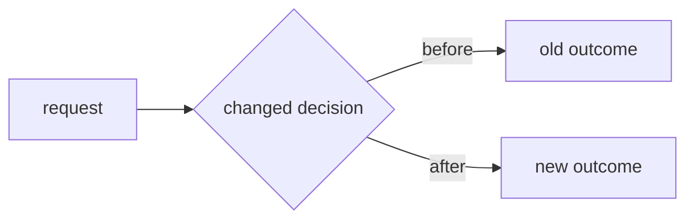

# Ship Changes — Publish and Follow Through

Create the PR quickly and independently. Ask the user only when a decision is
both necessary and impossible to infer safely. A missing optional input is a
reason to omit or mark a gap, not a reason to stop PR creation.

## Routing precedence

Treat phrases such as "create PR", "open PR", "ship it", "send this to review",
and "commit and push" as `vs-ship-it` requests. Prefer this workflow over a
generic publisher such as `github:yeet`; do not compose two publishers.

Use another publishing skill only when the user explicitly names it or this
skill is unavailable.

Compose `/vs-eval` only when the PR is a skill/eval contract. Skip it for
ordinary product PRs.

## Choose the outcome

- **Direct push:** when the user explicitly names `main`, `master`, the current
  branch, another destination branch, or asks to commit and push without a PR.
- **PR:** when the user asks to create/open a PR, submit for review, send to dev,
  or says bare `ship it` without naming a push destination.

If a named destination branch does not exist, report the repository default and
ask only when the intended destination remains ambiguous.

### Direct-push path

1. Inspect `git status -sb`, the scoped diff, current branch, and remotes.
   Preserve unrelated changes and stage only files in scope.
2. Reuse fresh validation. Run only repository-required or directly relevant
   checks that have not already passed.
3. Commit with a concise conventional message when needed.
4. Fetch the destination and stop on remote-ahead or non-fast-forward state.
5. Push exactly the requested branch and verify local and remote SHAs match.

Do not create a feature branch or PR in direct-push mode. Direct-push mode does
not start `vs-pr-walkthrough` or `vs-baby-sit`.

## PR workflow

The default PR path has five outcomes: prepare the PR description, prepare
available media, create plus verify a regular PR, start an exact-head walkthrough
for a large PR, and hand it to `vs-baby-sit`.

Code review is outside this workflow. Do not add brief generation, broad
verification, reviewer discovery, or broad QA unless the user explicitly
requested that work. Focused frontend evidence capture in Step 3 is part of
PR preparation.
Babysitting is the default after PR verification unless the user opts out.

### Step 1: Inspect and prepare the branch

Inspect once:

```bash
git branch --show-current
git status -sb
git diff HEAD --stat
git remote -v
```

Preserve unrelated changes. If on `main`, `master`, `prod`, or detached HEAD,
create a short `username/topic` feature branch. Stage only scoped paths, commit
with a concise conventional message, and push with `git push -u origin HEAD`.

Run only checks required by repository instructions before push. Reuse current
results; do not introduce `vs-before-after`, `vs-verify`, broad test suites, or another
user question as shipping ceremony. Record existing checks honestly in the PR.

If authentication fails, stop after the first failure, identify the credential
used, and give the exact re-authentication step. Do not retry unchanged auth.

### Step 2: Prepare the PR description

Write the description directly from the live conversation, scoped diff, runtime
evidence, and existing test results. Do not ask the user to write or approve PR
copy. If motivation cannot be established honestly, describe the observable
problem without inventing business impact; omit inapplicable optional detail.

Make the description visual first. A reviewer should see the change before
reading about it: matched Before/After proof leads, prose stays short, and
anything enumerable goes in a table, a code block, or a diagram instead of a
paragraph. Every PR description must include **Before** and **After**:
compare the same actor, input, and precondition, then state the concrete result
on each side and why the difference matters. Choose the proof shape from what
actually changed:

| What changed | Proof to embed |
| --- | --- |
| Static UI state | Matched screenshots at the same viewport and data |
| Motion, timing, dragging, multi-step interaction | One short video per interaction |
| CLI, API, log, or error output | Paired output blocks copied verbatim from the same input |
| Numbers such as latency, size, count, rate | A table that shows both operands beside any derived figure (`240 ms → 90 ms`, not a bare `2.7× faster`) |
| Control or data flow, ordering, topology | A fenced `mermaid` diagram of the changed path; GitHub renders it natively |
| A decisive logic change | A fenced `diff` block of the key hunk, trimmed to the lines that carry the change |

Prefer a compact comparison table for several outcomes; use a small paired
Mermaid flow when a backend or lifecycle change is easier to understand
visually. Neither replaces evidence. Label source-derived comparisons
**Source-derived**, not observed or tested.

Borrow the discipline of the explaining skills and apply it inline; do not
spawn them as shipping phases. From `vs-before-after`: same setup on both
sides, each claim labeled observed, tested, or source-derived, and the relevant
behavior that intentionally stayed the same. From `vs-show-me`: conclusion
first, structure drawn as a diagram rather than described, and no metric or
status the evidence does not contain. From `vs-eli5`: when the mechanism is not
obvious, one familiar analogy mapped to the real parts, not a glossary.

Keep the first screen short. Fold anything longer than about twenty lines — a
full output capture, a wider diff, a second video — into
`<details><summary>…</summary></details>` so the proof stays above the fold.
Never paste the whole diff; the Files tab already has it. The first screen
answers what was wrong, why this repair is appropriate, and what visibly
changed. Use this structure:

````markdown
<feature_area>: <Title> (80 chars max; this line is the `--title`, and the
body file starts at the first heading)

## What Problem This Solves

<Observed problem, impact, diagnosis, and important system boundary, in two or
three sentences.>

**Before** <same-state setup and what to notice>

<Hosted screenshot Markdown, a hosted video URL on its own bare line, or a
fenced output block.>

**After** <same-state setup and what changed>

<Matched hosted screenshot, bare video URL, or the paired output block.>

## Why This Change Was Made

<Root cause and why this boundary owns the repair. When the path changed, draw
it instead of narrating it:>



<When one hunk explains the fix, show only that hunk:>

```diff
- old line that caused the problem
+ new line that repairs it
```

## User Impact

<Concrete user, developer, or operational outcome.>

| | Before | After |
| --- | --- | --- |
| <observable outcome> | <old> | <new> |
| <intentionally unchanged behavior> | <same> | <same> |

## Evidence

- **Before:** <observed or measured failure> (observed | tested | source-derived)
- **After:** <matched result> (observed | tested | source-derived)
- **Automated:** `<focused or required command>` — <result>
- **Still unverified:** <exact gap, only when one remains>

<details><summary>Full output and wider diff</summary>

<long capture or wider hunk>

</details>

## Review focus

<The first one or two paths to read and any human judgment still needed. Omit
for a trivial change.>
````

Drop any template row, block, or section the evidence does not fill; an empty
diagram or a table of one row is worse than prose.

For CLI/API behavior, replace visual proof with exact paired output from the
same input. For a new feature, describe the previous absence or workaround under Before
and the new capability under After; keep the pair even when only After has media.
For internal work, compare the old and new mechanism and explicitly state when
observable behavior is unchanged. Never fabricate evidence,
include AI-session narration, or add a file-by-file changelog.

Write Markdown to a temporary body file and use `--body-file`; never pass
backtick-heavy Markdown through inline `--body` or `gh pr edit --body`.

### Step 3: Prepare screenshots and video

Before creating the PR, inspect the current session and known build/QA artifacts
for local media that directly proves the changed behavior.

- Use matched screenshots for static visual states.
- Use short matched recordings for motion, timing, scrolling, dragging,
  resizing, or multi-step interactions.
- Reuse valid existing proof tied to the actual base and head being compared.
- For frontend changes, capture missing matched screenshots before publishing;
  add short matched recordings for interaction or motion changes. Use the
  same route, data, viewport, and interaction on both revisions. Label each
  revision and caption each image or recording with what to notice.
- Use the base revision in an isolated worktree or a verified base preview;
  preserve the user's working tree. Never recreate the Before state by editing
  the After screenshot or present head media as baseline evidence.
- Follow
  [`../vs-internal-shared/references/preview.md`](../vs-internal-shared/references/preview.md)
  to reuse a surface or start a focused preview, and
  [`../vs-internal-shared/references/recording.md`](../vs-internal-shared/references/recording.md)
  for recording, visible pointer/clicks, matched stills, and transcoding.
  This capture needs no extra permission question within the authorized task;
  honor an explicit no-browser/no-capture constraint. Do not rerun broad QA.
  For this capture-only path, stop previews you started after capture unless
  the user requested a live preview; leave pre-existing servers alone. This
  overrides the shared preview's leave-running rule for human handoffs.
- If capture is blocked by missing tools, access, or a runnable baseline, keep
  the textual Before/After and any valid media; state the exact visual-proof gap
  under Evidence. If no valid media exists, continue without asking the user to
  find it. Never fabricate or silently omit the missing side.

Upload each available image or video directly to GitHub's user-attachments CDN.
This is the same hosting surface as drag-and-drop, inherits repository
visibility, and needs no browser, Computer Use, draft comment, or vision tool.

Resolve the numeric repository ID (`gh repo view --json` has no such field):

```bash
gh api repos/{owner}/{repo} --jq .id
```

Upload each file using its real MIME type and a URL-encoded filename/MIME value:

```bash
curl -sS --fail-with-body \
  "https://uploads.github.com/user-attachments/assets?name=<url-encoded-filename>&content_type=<url-encoded-mime>&repository_id=<repository-id>" \
  -X POST \
  -H "Authorization: Bearer $(gh auth token)" \
  -H "Accept: application/json" \
  --data-binary @<absolute-file-path> | jq -er .url
```

Images use their actual type, such as `image/png`, `image/jpeg`, or `image/webp`.
Video uses `video/mp4` or `video/webm`. For broad playback, transcode Playwright
WebM when `ffmpeg` is available:

```bash
ffmpeg -i in.webm -c:v libx264 -pix_fmt yuv420p out.mp4
```

Embed images as ``. Embed videos as the
returned URL on its own bare line; `` does not render GitHub's video player.
Insert the URLs into the body file before `gh pr create` so the initial PR
description is complete.

Treat HTTP 422 as an unsupported media type and HTTP 404 as a bad repository ID
or missing push access. On upload failure, continue creating the PR, omit the
broken embed, and name the exact gap. Never commit proof assets to the product
branch or create a `.github/pr-assets` directory.

Vision may inspect, compare, or caption screenshots when already needed for the
PR evidence. It is not part of the upload transport.

### Step 4: Create and verify the PR

Create a regular PR from the prepared body file. Do not pass `--draft`: the PR
is reviewable from the first head, and the babysitter protects an unverified
head by converting to draft only around a repair.

```bash
gh pr create --title "<title>" --body-file "$BODY_FILE"
```

Immediately re-resolve it from the same checkout and verify open state, branch,
and exact head SHA:

```bash
PR_JSON=$(gh pr view --json number,url,title,state,isDraft,headRefName,headRefOid,changedFiles)
LOCAL_BRANCH=$(git branch --show-current)
LOCAL_HEAD=$(git rev-parse HEAD)

echo "$PR_JSON" | jq -e \
  --arg branch "$LOCAL_BRANCH" --arg head "$LOCAL_HEAD" \
  '.state == "OPEN" and .isDraft == false and .headRefName == $branch and .headRefOid == $head' >/dev/null || exit 1

PR_NUM=$(echo "$PR_JSON" | jq -r '.number')
PR_URL=$(echo "$PR_JSON" | jq -r '.url')
HEAD_SHA=$(echo "$PR_JSON" | jq -r '.headRefOid')
CHANGED_FILES=$(echo "$PR_JSON" | jq -r '.changedFiles')
printf '%s\n' "$PR_URL"
```

On association failure, run authenticated `gh auth status`, report the exact
mismatch, and stop. Do not switch branches before this succeeds.

Re-open the PR description read-only and verify every uploaded image renders and
every video exposes a player. If rendering fails, remove or correct only the
broken embed with `gh pr edit --body-file`; do not claim the proof is attached.

Apply only explicitly requested PR modifiers. Do not suggest reviewers or run broad QA by default. Preview startup is
limited to the focused evidence capture in Step 3.

### Step 5: Start the walkthrough and babysitting

Use `changedFiles` from the verified PR instead of spawning a child merely to
rediscover the size gate:

- Fewer than 10 changed files: do not start a walkthrough child. Record
  `SKIPPED_SMALL_PR`; GitHub's native diff is the clearer review surface.
- 10 or more changed files: load and follow
  [`../vs-pr-walkthrough/SKILL.md`](../vs-pr-walkthrough/SKILL.md). Spawn one
  fresh-context child with the repository, `PR_URL`, exact `HEAD_SHA`, and that
  building block's return contract. The child owns only the walkthrough
  artifact; it must not mutate the PR or watch CI.

Confirm the walkthrough child is live. Hand the verified PR to `vs-baby-sit`
immediately without waiting for the artifact. The walkthrough and babysitter
are independent lanes, so this large-PR path may use the shared deep
allowance for exactly those two active children. Babysit still owns its single
watcher and the draft-around-repair transition back to ready for review;
ship-it does not duplicate that skill's CI or automated-review loop.
If the user explicitly says not to watch, collect the walkthrough once after
the creation handoff instead.

Collect a completed walkthrough at the next babysitting phase gate. Before
showing its `Saved` link, re-resolve the PR and require its current `headRefOid`
to equal the walkthrough's `Explains` SHA:

- Same head: surface the walkthrough in the handoff.
- Changed head: do not surface the stale artifact and do not regenerate after
  each repair push. At `reason: ready-for-review`, refresh it once on that exact
  head while the resumed watcher continues, then apply the same head check.
- Failed, incomplete, or stale again: continue babysitting and report the exact
  walkthrough gap. A review aid never blocks publishing, repair, or the
  `review-approval` stop.

The automatic path is bounded to one initial walkthrough and at most one final
refresh. Never prepare a walkthrough before the PR exists; its URL, exact head,
and authoritative GitHub diff are required inputs.

When the composed babysitter reaches `reason: review-approval`, return its
concise `Review needed: @<user-or-team>` handoff and end the workflow turn. Do
not resume watching because auto-merge is armed or because merge, deployment,
or production verification is planned afterward. Those phases require a new
user turn after the human review gate clears.

## Handoff

After PR verification, emit the creation handoff and start a visibly separate
babysitting phase unless the user explicitly says not to watch:

The first line says what shipped in plain language. Translate literal check,
review, or PR status into the user-visible meaning before naming the status.

```markdown
PR created and verified: [#<N> — <title>](<PR_URL>)

- Head: `<short SHA>`
- State: open, ready for review — babysit follows CI and automated review on
  the exact head; a repair converts it to draft and returns it to ready for
  review only when the new head is green.
- Media: <N screenshots, N videos attached | none available | exact upload gap>
- Walkthrough: <[open walkthrough](<URL>) — exact <short SHA> | generating for
  exact head | skipped — small PR | exact gap>
- Checks: <fresh results reused or repository-required checks run>
```

Do not describe CI, deployment, preview behavior, or production as verified when
only PR creation succeeded.

When fresh verification evidence already exists with `WARN`, carry the WARN
wording into the PR and handoff; do not describe the change as fixed or
verified. Existing `FAIL` or `BLOCKED` evidence is reported as an open gap, not
silently replaced by PR-creation success.

If the change altered skill or plugin content, add the exact re-install command
to the handoff; the installed behavior remains stale until reinstalled.

## Codex goals

Create a Codex goal only when the user explicitly requested one. Complete the
finite shipping goal after the branch is pushed and the PR association plus
media rendering are verified. Babysitting remains a separate phase; create a
separate `vs-baby-sit` goal only when the user explicitly requested a Codex goal.

## Verification contract

- [ ] Only scoped changes were committed and pushed.
- [ ] The PR description was prepared without unnecessary user input.
- [ ] Available screenshots/video were uploaded before PR creation and render,
      or the exact media gap is visible in Evidence.
- [ ] Every PR has a concrete Before/After comparison, including new features
      and internal changes; source-derived claims are labeled.
- [ ] Frontend changes have matched screenshots and interaction video where
      relevant, or an exact capture blocker; captions explain the difference.
- [ ] Open non-draft PR state, branch, and head SHA were re-resolved
      successfully.
- [ ] A 10+ file PR started one exact-head walkthrough child without delaying
      babysitting; a smaller PR spawned none.
- [ ] Any surfaced walkthrough matches the current PR head; repair pushes caused
      at most one final refresh.
- [ ] No brief, broad verify, reviewer lookup, or broad QA ran without an
      explicit request or repository requirement.
- [ ] `vs-baby-sit` started after PR verification unless the user explicitly opted out.
- [ ] The handoff reports PR URL, head, media, and checks.

Before the final handoff, apply
[Phase Boundaries](../vs-internal-shared/references/phase-boundaries.md). Keep
`Next` below as the semantic route; report a session action only when required
by that contract. Visual progress checkpoint: inherit
[`../vs-internal-shared/references/communication.md`](../vs-internal-shared/references/communication.md).
Pointer only; do not restate the map.

## Output style

Apply the [shared output style](../vs-internal-shared/references/output-style.md)
to every user-facing message.

## Workflow

Direct: emit **Next** only. Composed: return to caller.

**Prev:** `/vs-build-it`
**Next:** done
**Relevant:** `/vs-eval`
