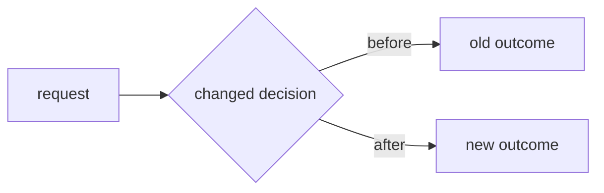

# Ship Changes — Publish and Follow Through

Create the PR quickly and independently. Ask the user only when a decision is
both necessary and impossible to infer safely. A missing optional input is a
reason to omit or mark a gap, not a reason to stop PR creation.

## Routing precedence

Treat phrases such as "create PR", "open PR", "ship it", "send this to review",
and "commit and push" as `vs-ship-it` requests. Prefer this workflow over a
generic publisher such as `github:yeet`; do not compose two publishers.

Use another publishing skill only when the user explicitly names it or this
skill is unavailable.

Compose `/vs-eval` only when the PR is a skill/eval contract. Skip it for
ordinary product PRs.

## Nothing built yet

At ship-it entry — before Direct-push or the PR workflow — detect whether
anything is built yet:

1. Inspect `git status -sb` and ahead/behind vs the default branch
   (`git rev-list --left-right --count origin/<default>...HEAD`).
2. If the working tree has **no scoped changes to publish** (clean index and
   worktree for the intended scope) **and** the current branch is not a feature
   branch with commits ahead of the default that constitute the thing to ship
   (nothing new vs base), do **not** create an empty PR and
   do **not** stop with only "nothing to ship".
3. When there is a **buildable intent** — a plan/spec/outcome the user just
   shaped, or an explicit "ship it" on work that was only discussed/planned —
   announce one line that you are running build-it first, **Read and follow
   `vs-build-it`**, then when the build-it handoff says ready, **resume ship-it**
   on the resulting branch/diff (full PR path unless the user named
   immediate/direct). Skill-only / docs-only empty trees still follow this when
   the user asked to ship a planned skill change that is not implemented yet.
4. If there is also **no plan/outcome** to build (empty tree and no prior plan),
   stop and ask once what to build — do not invent scope.
5. Do not recurse: if already inside a build-it→ship-it handoff, skip this gate.
6. Direct-push with an empty tree: same compose (build then push)
   only if the user named a destination; otherwise prefer the PR path after build.

## Choose the outcome

- **Direct push:** when the user explicitly names `main`, `master`, the current
  branch, another destination branch, or asks to commit and push without a PR.
- **PR:** when the user asks to create/open a PR, submit for review, send to dev,
  or says bare `ship it` without naming a push destination.

If a named destination branch does not exist, report the repository default and
ask only when the intended destination remains ambiguous.

### Direct-push path

1. Inspect `git status -sb`, the scoped diff, current branch, and remotes.
   Preserve unrelated changes and stage only files in scope.
2. Reuse fresh validation. Run only repository-required or directly relevant
   checks that have not already passed.
3. Commit with a concise conventional message when needed.
4. Fetch the destination and stop on remote-ahead or non-fast-forward state.
5. Push exactly the requested branch and verify local and remote SHAs match.

Do not create a feature branch or PR in direct-push mode. Direct-push mode does
not start `vs-pr-walkthrough` or `vs-baby-sit`.

## PR workflow

The default PR path has five outcomes: prepare the PR description, prepare
available media, create plus verify a regular PR, start an exact-head walkthrough
for a large PR, and hand it to `vs-baby-sit`.

Code review is outside this workflow. Do not add brief generation, broad
verification, reviewer discovery, or broad QA unless the user explicitly
requested that work. Focused frontend evidence capture in Step 3 is part of
PR preparation.
Babysitting is the default after PR verification unless the user opts out.

### Step 1: Inspect and prepare the branch

Inspect once:

```bash
git branch --show-current
git status -sb
git diff HEAD --stat
git remote -v
```

Preserve unrelated changes. If on `main`, `master`, `prod`, or detached HEAD,
create a short `username/topic` feature branch. Stage only scoped paths, commit
with a concise conventional message, and push with `git push -u origin HEAD`.

Run only checks required by repository instructions before push. Reuse current
results; do not introduce `vs-before-after`, `vs-verify`, broad test suites, or another
user question as shipping ceremony. Record existing checks honestly in the PR.

If authentication fails, stop after the first failure, identify the credential
used, and give the exact re-authentication step. Do not retry unchanged auth.

### Step 2: Prepare the PR description

Write the description directly from the live conversation, scoped diff, runtime
evidence, and existing test results. Do not ask the user to write or approve PR
copy. If motivation cannot be established honestly, describe the observable
problem without inventing business impact; omit inapplicable optional detail.

Make the description visual first. A reviewer should see the change before
reading about it: the leading summary shape is one visual (not a prose wall),
matched Before/After proof follows, and anything enumerable goes in a table, a
code block, or a diagram instead of a paragraph.

For the leading summary under **What Problem This Solves**, pick **one** visual
type from this menu (use one; never all):

| Shape | When |
| --- | --- |
| Pseudocode | Logic or algorithm |
| Call tree | Runtime control flow |
| Component tree | UI structure, state, module boundaries |
| File tree | File responsibility or a broad refactor |
| Mermaid | Interaction, control flow, or data flow |
| Matched diff of that shape | The point is what changed and the surrounding shape already exists |

Keep Mermaid and key-hunk `diff` short; fold longer captures into details.
Every PR description must include **Before** and **After**:
compare the same actor, input, and precondition, then state the concrete result
on each side and why the difference matters. Choose the proof shape from what
actually changed:

| What changed | Proof to embed |
| --- | --- |
| Static UI state | Matched screenshots at the same viewport and data |
| Motion, timing, dragging, multi-step interaction | One short video per interaction |
| CLI, API, log, or error output | Paired output blocks copied verbatim from the same input |
| Endpoint, handler, or RPC behavior | **Endpoint** label, then one request and both responses to that same request (see Endpoint and schema proof) |
| Schema, migration, or wire contract | **Schema** label, then a fenced `diff` of the resulting shape before and after |
| HTML prototype or interactive demo | A hosted link the reviewer can click (see Prototype links) |
| Numbers such as latency, size, count, rate | A table that shows both operands beside any derived figure (`240 ms → 90 ms`, not a bare `2.7× faster`) |
| Control or data flow, ordering, topology | A fenced `mermaid` diagram of the changed path; GitHub renders it natively |
| A decisive logic change | A fenced `diff` block of the key hunk, trimmed to the lines that carry the change |

Prefer a compact comparison table for several outcomes; use a small paired
Mermaid flow when a backend or lifecycle change is easier to understand
visually. Neither replaces evidence. Label source-derived comparisons
**Source-derived**, not observed or tested.

Borrow the discipline of the explaining skills and apply it inline; do not
spawn them as shipping phases. From `vs-before-after`: same setup on both
sides, each claim labeled observed, tested, or source-derived, and the relevant
behavior that intentionally stayed the same. From `vs-show-me`: conclusion
first, structure drawn as a diagram rather than described, and no metric or
status the evidence does not contain. From `vs-eli5`: when the mechanism is not
obvious, one familiar analogy mapped to the real parts, not a glossary.

Keep the first screen short. Fold anything longer than about twenty lines — a
full output capture, a wider diff, a second video — into
`<details><summary>…</summary></details>` so the proof stays above the fold.
Never paste the whole diff; the Files tab already has it. The first screen
answers what was wrong, why this repair is appropriate, and what visibly
changed. Use this structure:

````markdown
<feature_area>: <Title> (80 chars max; this line is the `--title`, and the
body file starts at the first heading)

## Merge risk


<the irreversible step and what undoing it costs, or what makes reverting cheap>

<!-- For one-way, swap the badge to badge-one-way-door.svg with alt
     "One-way door: hard to reverse — review carefully". Never label one-way
     as safe to merge. -->


<who breaks and how widely, plus the adjacent surfaces this does not touch>

<!-- When blast is wide (many consumers / callers / tenants), swap the badge to
     badge-wide-blast.svg with alt "Wide blast radius: many consumers". Keep
     narrow on a narrow-blast PR — do not stamp wide-blast onto it. -->

## Surfaces

<Omit this section when paths prove no product surface and the PR is not solely Infra (skill-only / docs-only). Otherwise stamp only the UI · Endpoint · Schema · CLI · MCP classes the paths prove; Infra alone for solely CI/deploy/flags/env.>

<!-- Multi-select every product surface the changed paths prove — never invent a stamp.
     Omit Surfaces entirely for skill-only / docs-only when no path class matches.
     Infra only when the PR is solely CI/deploy/flags/env — never stack with a product surface.
     Endpoint not backend; Schema = wire + persistence (no separate DB).
     Wrapper precedence: MCP wrap of unchanged route → MCP only; CLI shim of unchanged MCP → CLI only.
     Surfaces are proof selectors, not risk art — Never invent backend/DB surface names or surface merge-risk SVGs. -->

## What Problem This Solves

<One short sentence of context, then the single chosen visual — pseudocode,
call tree, component tree, file tree, Mermaid, or a matched diff of that shape.
Not a wall of prose.>

**Before** <same-state setup and what to notice>

<Hosted screenshot Markdown, a hosted video URL on its own bare line, or a
fenced output block.>

**After** <same-state setup and what changed>

<Matched hosted screenshot, bare video URL, or the paired output block.>

## Why This Change Was Made

<Root cause and why this boundary owns the repair. When the path changed, draw
it instead of narrating it:>


```mermaid
flowchart LR
  A[request] --> B{changed decision}
  B -->|before| C[old outcome]
  B -->|after| D[new outcome]
```

<When one hunk explains the fix, show only that hunk:>

```diff
- old line that caused the problem
+ new line that repairs it
```

## User Impact

<Concrete user, developer, or operational outcome.>

| | Before | After |
| --- | --- | --- |
| <observable outcome> | <old> | <new> |
| <intentionally unchanged behavior> | <same> | <same> |

## Evidence

- **Before:** <observed or measured failure> (observed | tested | source-derived)
- **After:** <matched result> (observed | tested | source-derived)
- **Automated:** `<focused or required command>` — <result>
- **Still unverified:** <exact gap, only when one remains>

<details><summary>Full output and wider diff</summary>

<long capture or wider hunk>

</details>

## Review focus

<The first one or two paths to read and any human judgment still needed. Omit
for a trivial change.>
````

Drop any template row, block, or section the evidence does not fill; an empty
diagram or a table of one row is worse than prose. **Merge risk** is not
droppable: it is how the reviewer decides how much attention this PR deserves.

Classify merge risk from the scoped diff, never from the change's intent:

| Signal in the diff | Door | Reason |
| --- | --- | --- |
| Schema migration, data backfill, destructive write, deletion | One-way | Reverting the code does not revert the data |
| Published artifact, release, public API or wire-contract change | One-way | Consumers pin the old shape |
| Auth, permissions, billing, or anything with a side effect on send | One-way | The effect escapes before a revert lands |
| Behavior behind a flag, internal refactor, copy, styling, tests | Two-way | `git revert` restores the previous behavior |

Meanings stay literal. **Two-way** = easy to revert. **One-way** = hard to
reverse — review carefully. Never map one-way to "safe to merge". Blast radius
is a separate axis from the door: a two-way change can still have a wide blast.

State the blast radius as who breaks and how widely, not as a severity word:
one route, one command, every caller of a shared helper, every tenant. Name the
adjacent surfaces the change does **not** touch — the bounded half is what lets
a reviewer skip the rest. When the diff is one-way or broad, say what makes it
recoverable (flag, staged rollout, backup, reversible migration) or state that
nothing does. Two lines is the whole budget; if the classification is uncertain,
write the uncertainty rather than the reassuring guess.

### Merge-risk badges

Under **Merge risk**, the badge is the label: put the matching catalog badge
on its own line with no `**Door:**` or `**Blast radius:**` text around it, and
the one-line explanation directly under it, so the reviewer reads the risk
before the reason:

```html
-door.svg">

<what makes this one-way or two-way>

-blast.svg">

<who breaks and how widely>
```

Catalog (committed under `skills/vs-ship-it/assets/`, generated by
`scripts/generate-badges.mts`):

| Badge | When | File | Alt |
| --- | --- | --- | --- |
| Two-way door | Door is two-way | `badge-two-way-door.svg` | Two-way door: easy to revert |
| One-way door | Door is one-way | `badge-one-way-door.svg` | One-way door: hard to reverse — review carefully |
| Wide blast | Blast radius is wide / many consumers | `badge-wide-blast.svg` | Wide blast radius: many consumers |
| Narrow blast | Blast radius is narrow / contained | `badge-narrow-blast.svg` | Narrow blast radius: contained |

Each badge carries its own background, so one file reads in GitHub light and
dark mode; no `<picture>` pair is needed. Use stable `raw.githubusercontent.com`
URLs against the master path:

`https://raw.githubusercontent.com/vltansky/vs/master/skills/vs-ship-it/assets/<file>`

PR description bodies on github.com do not reliably resolve relative repo paths,
so prefer these absolute raw URLs. They render after the assets land on
`master`. Embed the door badge that matches the door classification; embed the wide-blast
badge only when blast is wide, and the narrow-blast badge otherwise. Badges
classify risk and are not visual proof: `pr-media-gate.mjs` does not count them.
Do not invent other badges or hand-edit the SVGs; change the generator and
rerun it. Walkthrough HTML is out of scope here — leave `/vs-pr-walkthrough`
alone.

### Surfaces

Surfaces are proof selectors, not risk art. Stamp every product surface the
changed paths prove; do not invent merge-risk SVGs for them. Door and blast
badges stay the only merge-risk catalog images. Omit Surfaces when paths prove
no product surface and the PR is not solely Infra (skill-only / docs-only) —
never invent a product stamp to fill the section.

Vocabulary (locked): **UI · Endpoint · Schema · CLI · MCP**. Infra only when the PR is solely CI/deploy/flags/env — never stack with a product surface.
Names lock: Endpoint not backend; Schema = wire + persistence (no separate DB).
Never invent backend/DB surface names.

Wrapper precedence: MCP wrap of unchanged route → MCP only; CLI shim of unchanged MCP → CLI only.
Multi-select when paths match more than one class. `pr-media-gate.mjs` asserts
claim↔path: any stamped product surface without a matching path class fails
(skill-only + Schema included); migration-only ≠ UI; MCP-wrap-only ≠ Endpoint;
Infra+product fails; Infra without infra paths fails; stamping backend/DB fails;
>3 product surfaces without matching path classes fails.

CLI and MCP proof blocks are Later — this cut only selects those surfaces; do
not invent paired CLI/MCP contract blocks yet.

### Endpoint and schema proof

Endpoint and Schema PRs show the contract move, the same way UI PRs show pixels.
`pr-media-gate.mjs` enforces both shapes from the changed paths:

- **Endpoint** — handler, controller, resolver, route, or RPC code changed.
  Name the method and path, give one request, then the Before and After
  response to that same request. Capture real output (curl, test client,
  recorded fixture) against each revision; fold a large payload into one
  fenced `diff` of the response. Handler change with identical responses:
  write `No contract change: <why>`.
- **Schema** — migration, SQL, Prisma, GraphQL, proto, Avro, OpenAPI, or JSON
  Schema changed (wire + persistence; no separate DB surface). Show a fenced
  `diff` of the resulting shape (columns, fields, types, nullability, defaults),
  not the migration script. No shape change (index, comment, reformat): write
  `No schema change: <why>`.

````markdown
**Endpoint** `POST /v1/tokens/refresh`

```http
POST /v1/tokens/refresh
{"refreshToken": "r_123"}
```

```diff
 {
   "token": "t_456",
+  "expiresAt": "2026-09-30T12:00:00Z"
 }
```

**Schema** `tokens`

```diff
 CREATE TABLE tokens (
   id          text PRIMARY KEY,
+  expires_at  timestamptz NOT NULL
 );
```
````

These blocks are the Before/After proof for an Endpoint or Schema PR: put them
directly under **Before**/**After** instead of repeating the same fact in User
Impact and Evidence. Response JSON written from source rather than captured is
labeled source-derived, and Evidence adds
`**Still unverified:** endpoint response; <blocker>`. An Endpoint/Schema-only
PR needs no visual-proof line at all.

Pass `--api <regex>` or `--schema <regex>` when the repository's layout does
not match the defaults. A capture blocker is stated per kind:
`**Still unverified:** endpoint response; <blocker>` or
`**Still unverified:** schema diff; <blocker>`.

### Prototype links

For an HTML prototype or interactive demo, give the reviewer a hosted link
instead of a local file: `using-wix-stash` (Wix Stash) or a Claude Artifact
(the `Artifact` tool), whichever the environment has; `vs-prototype` builds
the page. Private-by-default hosts need an explicit share step before the link
is useful. A link complements matched screenshots; it does not replace them.

For CLI/API behavior, replace visual proof with exact paired output from the
same input. For a new feature, describe the previous absence or workaround under Before
and the new capability under After; keep the pair even when only After has media.
For internal work, compare the old and new mechanism and explicitly state when
observable behavior is unchanged. Never fabricate evidence,
include AI-session narration, or add a file-by-file changelog.

Write Markdown to a temporary body file and use `--body-file`; never pass
backtick-heavy Markdown through inline `--body` or `gh pr edit --body`.

### Step 3: Prepare screenshots and video

Before creating the PR, inspect the current session and known build/QA artifacts
for local media that directly proves the changed behavior.

- Use matched screenshots for static visual states.
- Use short matched recordings for motion, timing, scrolling, dragging,
  resizing, or multi-step interactions.
- Reuse valid existing proof tied to the actual base and head being compared.
- Reuse demo scenarios from the approved Evidence plan; fill only missing
  scenarios from the changed behavior. Use the shared `capture-demo.mjs` helper
  when the selected recording route is Playwright; do not switch browser routes
  merely to use it.
- For frontend changes, capture missing matched screenshots before publishing;
  add short matched recordings for interaction or motion changes. Use the
  same route, data, viewport, and interaction on both revisions. Label each
  revision and caption each image or recording with what to notice.
- Use the base revision in an isolated worktree or a verified base preview;
  preserve the user's working tree. Never recreate the Before state by editing
  the After screenshot or present head media as baseline evidence.
- Follow
  [`../vs-internal-shared/references/preview.md`](../vs-internal-shared/references/preview.md)
  to reuse a surface or start a focused preview, then capture with
  [`../vs-internal-shared/scripts/record-flow.mjs`](../vs-internal-shared/scripts/record-flow.mjs).
  Write the captions as data before capturing: a `flow.json` whose steps
  each carry a `caption` (what to notice), an action, and a `still` name.
  Run it once per revision from the project that has Playwright installed
  (or set `PLAYWRIGHT_MODULE`):

  ```bash
  node <vs-internal-shared>/scripts/record-flow.mjs flow.json --out "$EVIDENCE_DIR/after"
  ```

  The script draws the caption and pointer into every still and video frame,
  writes `captions.vtt`, and prints a manifest (paths, captions, bytes,
  sha256). Write the PR body from that manifest. Do not Read the captured
  images or video: the manifest already states what each one shows, and a
  1280x720 PNG costs more context than the whole PR body. Open a still only
  when the user asks or when a capture step failed and the failure text points
  at the frame.
  [`../vs-internal-shared/references/recording.md`](../vs-internal-shared/references/recording.md)
  covers hand-rolled recordings, visible pointer/clicks, and transcoding.
  This capture needs no extra permission question within the authorized task;
  honor an explicit no-browser/no-capture constraint. Do not rerun broad QA.
  For this capture-only path, stop previews you started after capture unless
  the user requested a live preview; leave pre-existing servers alone. This
  overrides the shared preview's leave-running rule for human handoffs.
- If capture is blocked by missing tools, access, or a runnable baseline, keep
  the textual Before/After and any valid media; state the exact visual-proof gap
  under Evidence. If no valid media exists, continue without asking the user to
  find it. Never fabricate or silently omit the missing side.

Upload each available image or video directly to GitHub's user-attachments CDN.
This is the same hosting surface as drag-and-drop, inherits repository
visibility, and needs no browser, Computer Use, draft comment, or vision tool.

Resolve the numeric repository ID (`gh repo view --json` has no such field):

```bash
gh api repos/{owner}/{repo} --jq .id
```

Upload each file using its real MIME type and a URL-encoded filename/MIME value:

```bash
curl -sS --fail-with-body \
  "https://uploads.github.com/user-attachments/assets?name=<url-encoded-filename>&content_type=<url-encoded-mime>&repository_id=<repository-id>" \
  -X POST \
  -H "Authorization: Bearer $(gh auth token)" \
  -H "Accept: application/json" \
  --data-binary @<absolute-file-path> | jq -er .url
```

Images use their actual type, such as `image/png`, `image/jpeg`, or `image/webp`.
Video uses `video/mp4` or `video/webm`. For broad playback, transcode Playwright
WebM when `ffmpeg` is available:

```bash
ffmpeg -i in.webm -c:v libx264 -pix_fmt yuv420p out.mp4
```

Embed images as ``. Embed videos as the
returned URL on its own bare line; `` does not render GitHub's video player.
Insert the URLs into the body file before `gh pr create` so the initial PR
description is complete. Use the manifest caption as the image caption.

Then run the proof gate on the body file. It reads git and the body, never the
media, and refuses a PR that shows nothing:

```bash
node <vs-internal-shared>/scripts/pr-media-gate.mjs "$BODY_FILE" --base origin/<base>
```

- Exit 0: the body carries both a **Before** and an **After** marker, carries a
  door and a blast-radius badge (or a **Door** and **Blast radius** label), and
  hosted media is embedded, or the body states `**Still unverified:** visual proof; <exact blocker>`, or it
  states `No visual change: <why>` for a refactor with identical output, or no
  frontend path changed; and every endpoint or schema change carries its
  **Endpoint** or **Schema** block (or `No contract change` / `No schema
  change` / a per-kind stated gap).
- Exit 1: add the missing side of the comparison, add the missing merge-risk
  line, or capture with `record-flow.mjs` and upload, or write the exact gap in
  the body. Do not create the PR from a failing body. Local paths never count:
  the reviewer cannot open them. Never fabricate the missing side to clear the
  gate.
- Exit 2: the gate could not check (no base ref); pass `--base` and re-run.
  Never report a not-checked run as a pass.

Keep each clip's scenario, viewport/fixture, recorded revision, and uploaded URL
with the evidence. After a later push, compare the recorded revision with the
current head for that demonstrated flow. Rerecord affected clips when visible
behavior changed; retain unaffected clips with their original revision and a
short reason they still apply. Do not relabel an old recording as current-head
proof. Preserve this mapping when refreshing the PR description.

Treat HTTP 422 as an unsupported media type and HTTP 404 as a bad repository ID
or missing push access. On upload failure, continue creating the PR, omit the
broken embed, and name the exact gap. Never commit proof assets to the product
branch or create a `.github/pr-assets` directory.

Vision may inspect, compare, or caption screenshots when already needed for the
PR evidence. It is not part of the upload transport.

### Step 4: Create and verify the PR

Create a regular PR from the prepared body file. Do not pass `--draft`: the PR
is reviewable from the first head, and the babysitter protects an unverified
head by converting to draft only around a repair.

```bash
gh pr create --title "<title>" --body-file "$BODY_FILE"
```

Immediately re-resolve it from the same checkout and verify open state, branch,
and exact head SHA:

```bash
PR_JSON=$(gh pr view --json number,url,title,state,isDraft,headRefName,headRefOid,changedFiles)
LOCAL_BRANCH=$(git branch --show-current)
LOCAL_HEAD=$(git rev-parse HEAD)

echo "$PR_JSON" | jq -e \
  --arg branch "$LOCAL_BRANCH" --arg head "$LOCAL_HEAD" \
  '.state == "OPEN" and .isDraft == false and .headRefName == $branch and .headRefOid == $head' >/dev/null || exit 1

PR_NUM=$(echo "$PR_JSON" | jq -r '.number')
PR_URL=$(echo "$PR_JSON" | jq -r '.url')
HEAD_SHA=$(echo "$PR_JSON" | jq -r '.headRefOid')
CHANGED_FILES=$(echo "$PR_JSON" | jq -r '.changedFiles')
printf '%s\n' "$PR_URL"
```

On association failure, run authenticated `gh auth status`, report the exact
mismatch, and stop. Do not switch branches before this succeeds.

Re-open the PR description read-only and verify every uploaded image renders and
every video exposes a player. If rendering fails, remove or correct only the
broken embed with `gh pr edit --body-file`; do not claim the proof is attached.

Apply only explicitly requested PR modifiers. Do not suggest reviewers or run broad QA by default. Preview startup is
limited to the focused evidence capture in Step 3.

### Step 5: Start the walkthrough and babysitting

Use `changedFiles` from the verified PR instead of spawning a child merely to
rediscover the size gate:

- Fewer than 10 changed files: do not start a walkthrough child. Record
  `SKIPPED_SMALL_PR`; GitHub's native diff is the clearer review surface.
- 10 or more changed files: load and follow
  [`../vs-pr-walkthrough/SKILL.md`](../vs-pr-walkthrough/SKILL.md). Spawn one
  fresh-context child with the repository, `PR_URL`, exact `HEAD_SHA`, and that
  building block's return contract. The child owns only the walkthrough
  artifact; it must not mutate the PR or watch CI.

Confirm the walkthrough child is live. Hand the verified PR to `vs-baby-sit`
immediately without waiting for the artifact. The walkthrough and babysitter
are independent lanes, so this large-PR path may use the shared deep
allowance for exactly those two active children. Babysit still owns its single
watcher and the draft-around-repair transition back to ready for review;
ship-it does not duplicate that skill's CI or automated-review loop.
If the user explicitly says not to watch, collect the walkthrough once after
the creation handoff instead.

Collect a completed walkthrough at the next babysitting phase gate. Before
showing its `Saved` link, re-resolve the PR and require its current `headRefOid`
to equal the walkthrough's `Explains` SHA:

- Same head: surface the walkthrough in the handoff.
- Changed head: do not surface the stale artifact and do not regenerate after
  each repair push. At `reason: ready-for-review`, refresh it once on that exact
  head while the resumed watcher continues, then apply the same head check.
- Failed, incomplete, or stale again: continue babysitting and report the exact
  walkthrough gap. A review aid never blocks publishing, repair, or the
  `review-approval` stop.

The automatic path is bounded to one initial walkthrough and at most one final
refresh. Never prepare a walkthrough before the PR exists; its URL, exact head,
and authoritative GitHub diff are required inputs.

When the composed babysitter reaches `reason: review-approval`, return its
concise `Review needed: @<user-or-team>` handoff and end the workflow turn. Do
not resume watching because auto-merge is armed or because merge, deployment,
or production verification is planned afterward. Those phases require a new
user turn after the human review gate clears.

## Handoff

After PR verification, emit the creation handoff and start a visibly separate
babysitting phase unless the user explicitly says not to watch:

The first line says what shipped in plain language. Translate literal check,
review, or PR status into the user-visible meaning before naming the status.

```markdown
PR created and verified: [#<N> — <title>](<PR_URL>)

- Head: `<short SHA>`
- State: open, ready for review — babysit follows CI and automated review on
  the exact head; a repair converts it to draft and returns it to ready for
  review only when the new head is green.
- Merge risk: <two-way | one-way> door, <blast radius in a few words>
- Media: <N screenshots, N videos attached | none available | exact upload gap>
- Walkthrough: <[open walkthrough](<URL>) — exact <short SHA> | generating for
  exact head | skipped — small PR | exact gap>
- Checks: <fresh results reused or repository-required checks run>
```

Do not describe CI, deployment, preview behavior, or production as verified when
only PR creation succeeded.

The creation handoff is a progress message, not the end of the turn. Unless
the user explicitly opted out of watching, load `vs-baby-sit` and start it in
the same turn right after printing the handoff. Ending the turn with "Next: hand
off to vs-baby-sit" or an offer to watch is a skipped phase, not a handoff.

When fresh verification evidence already exists with `WARN`, carry the WARN
wording into the PR and handoff; do not describe the change as fixed or
verified. Existing `FAIL` or `BLOCKED` evidence is reported as an open gap, not
silently replaced by PR-creation success.

If the change altered skill or plugin content, add the exact re-install command
to the handoff; the installed behavior remains stale until reinstalled.

## Codex goals

Create a Codex goal only when the user explicitly requested one. Complete the
finite shipping goal after the branch is pushed and the PR association plus
media rendering are verified. Babysitting remains a separate phase; create a
separate `vs-baby-sit` goal only when the user explicitly requested a Codex goal.

## Verification contract

- [ ] Only scoped changes were committed and pushed.
- [ ] The PR description was prepared without unnecessary user input.
- [ ] Available screenshots/video were uploaded before PR creation and render,
      or the exact media gap is visible in Evidence.
- [ ] Every PR has a concrete Before/After comparison, including new features
      and internal changes; source-derived claims are labeled. The gate enforces
      the pair on every PR, not only frontend ones.
- [ ] Every PR classifies merge risk: a one-way/two-way door and a blast
      radius, both derived from the diff, both in the handoff.
- [ ] Merge risk shows the matching badges, each alone on its line with the
      explanation under it and no text label (wide-blast only when blast is
      wide), using
      `raw.githubusercontent.com/vltansky/vs/master/skills/vs-ship-it/assets/badge-*.svg`.
- [ ] Surfaces lists only UI|Endpoint|Schema|CLI|MCP classes the paths prove
      (Infra alone on infra-only PRs), or the section is omitted for skill-only /
      docs-only; no backend/DB stamps; no surface merge-risk SVGs.
- [ ] Frontend changes have matched screenshots and interaction video where
      relevant, or an exact capture blocker; captions explain the difference.
- [ ] Endpoint and schema changes show one request with both responses and a
      schema `diff`, or state why not.
- [ ] `pr-media-gate.mjs` exited 0 on the final body file before `gh pr create`;
      captured images were not read into context.
- [ ] Open non-draft PR state, branch, and head SHA were re-resolved
      successfully.
- [ ] A 10+ file PR started one exact-head walkthrough child without delaying
      babysitting; a smaller PR spawned none.
- [ ] Any surfaced walkthrough matches the current PR head; repair pushes caused
      at most one final refresh.
- [ ] No brief, broad verify, reviewer lookup, or broad QA ran without an
      explicit request or repository requirement.
- [ ] `vs-baby-sit` started after PR verification unless the user explicitly opted out.
- [ ] The handoff reports PR URL, head, media, and checks.

Before the final handoff, apply
[Phase Boundaries](../vs-internal-shared/references/phase-boundaries.md). Keep
`Next` below as the semantic route; report a session action only when required
by that contract. Visual progress checkpoint: inherit
[`../vs-internal-shared/references/communication.md`](../vs-internal-shared/references/communication.md).
Pointer only; do not restate the map.

## Output style

Apply the [shared output style](../vs-internal-shared/references/output-style.md)
to every user-facing message.

## Workflow

Direct: emit **Next** only. Composed: return to caller.

**Prev:** `/vs-build-it`
**Next:** done
**Relevant:** `/vs-eval`
